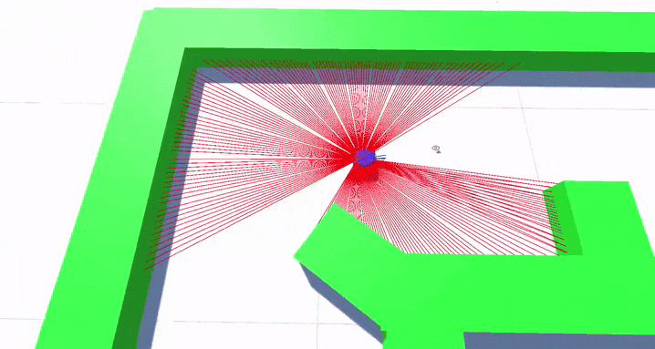

# Autonomous-Robot-Simulation
Simulation of an autonomously navigating robot.

 
Author: Cameron Rosenthal @Supernova1114
 

### Robot Parameters:
    safeDistanceThresh: // If an obstacle is within this distance, the robot will attempt to avoid it.
    goToFreeSpaceDistThresh: // Should be greater than safeDistanceThresh. If an obstacle is between this distance and safeDistanceThresh, the robot will traverse towards free space.
    maxMoveSpeed: // Normal move speed.
    maxRotationSpeed: // Normal rotation speed.
    avoidanceMoveSpeed: // Move speed during the robot's obstacle avoidance attempt.
    avoidanceRotationSpeed: // Rotation speed during the robot's obstacle avoidance attempt.

### Notes
- Robot uses a simulated 2D LIDAR module for ranging data.

### Video Preview
https://youtu.be/HtbmhMs_dQk?si=Of1G35uVCwFAjkB1

### Preview

